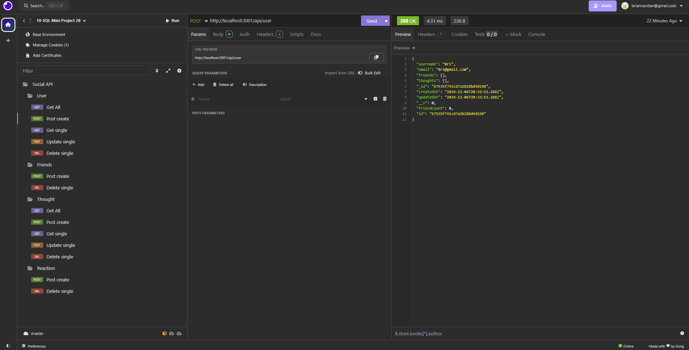

<div align="center">

[](https://opensource.org/licenses/MIT)


</div>


<div align="center">
  <a href="https://github.com/BriannaVitan/Social-Network-API">
  <!--  Correct this file path to a logo if you would like one; otherwise, delete this a href -->
  </a>

<!--  Edit App name -->
  <h3 align="center">Social Network API </h3>

  <p align="center">
  <!--  Edit App description -->
    This project is a RESTful API designed for a social networking platform, built using Express.js for routing and MongoDB for the database, with Mongoose as the ODM. The API allows users to interact with the platform by sharing thoughts, reacting to others' thoughts, and maintaining a friend list. The application is designed to handle large amounts of unstructured data efficiently, making it an ideal backend solution for a modern social networking site. That feature User Management to create, update, and delete users, thoughts, reactions, and friendsList from the platform
<!-- PROJECT LOGO -->
<br />
    <a href="https://github.com/BriannaVitan/Social-Network-API"><strong>Explore the docs »</strong></a>
    <br />
    <br />
    <!-- Edit deployment link -->
    <a href="https://drive.google.com/file/d/146-DgIhz8NoxZbCiIisfEf2StTsWHIvA/view?usp=drive_link
">Video Demo</a>
    ·
    <a href="https://github.com/BriannaVitan/Social-Network-API/issues">Report Bug</a>
    ·
    <a href="https://github.com/BriannaVitan/Social-Network-API/issues">Request Feature</a>

  </p>
</div>

<!-- TABLE OF CONTENTS -->
<details>
  <summary>Table of Contents</summary>
  <ol>
    <li>
      <a href="#about-the-project">About The Project</a>
      <ul>
        <li><a href="#built-with">Built With</a></li>
      </ul>
    </li>
    <li>
      <a href="#getting-started">Getting Started</a>
      <ul>
        <li><a href="#installation">Installation</a></li>
      </ul>
    </li>
    <li><a href="#usage">Usage</a></li>
    <li><a href="#contributing">Contributing</a></li>
    <li><a href="#license">License</a></li>
    <li><a href="#contact">Contact</a></li>
    <li><a href="#project-link">Project Link</a></li>
  </ol>
</details>

<!-- ABOUT THE PROJECT -->

## About The Project

<!--  Add your screenshots or demo videos here -->
<!-- Add screenshots using the following format: -->
<!--  -->
<!-- Add video demos using the following format: -->
<!--  -->

This project was built using Insomnia, MongoDB, Node, Express, and Mongoose.

### Built With

<div align="center">

<!--  Add any additional badges as needed. For more info, visit: https://github.com/404pandas/empty-resources/blob/main/assets/images/shields.md -->

[](https://javascript.info/)
[](https://developer.mozilla.org/en-US/docs/Web/CSS)
[](https://nodejs.org/en/)
[](https://expressjs.com/)
[](https://www.npmjs.com/)
[](https://code.visualstudio.com/docs)
[](https://www.postgresql.org/docs/)
[](https://www.typescriptlang.org/)
[](https://expressjs.com/)
[](https://www.npmjs.com/package/pg)
[](https://sequelize.org/)
[](https://www.npmjs.com/package/nodemon)


</div>

<!-- GETTING STARTED -->

## Getting Started

Once completely built, this application will function as a deployed app on Render.

### Local Installation / Testing

1. Clone the rep

```
git clone https://github.com/BriannaVitan/Social-Network-API
```

2. Install dependencies

```
npm i
```

3. Build the database

```
npm run build
```

4. Launch the app in development environment

```
npm start dev
```

5. Visit app:

[http://localhost:3001/](http://localhost:3001/)


See the [open issues](https://github.com/BriannaVitan/Social-Network-API/issues) for a full list of proposed features (and known issues).

## Usage 
[Video Demo](https://drive.google.com/file/d/146-DgIhz8NoxZbCiIisfEf2StTsWHIvA/view?usp=drive_link)


<!-- CONTRIBUTING -->

## Contributing

Contributions are what make the open source community such an amazing place to learn, inspire, and create. Any contributions you make are **greatly appreciated**.

If you have a suggestion that would make this better, please fork the repo and create a pull request. You can also simply open an issue with the tag "enhancement".
Don't forget to give the project a star! Thanks again!


<!-- LICENSE -->

## License

This project is licensed under the MIT license.

<!-- CONTACT -->

## Contact

<!--  Add your name, portfolio link, and email if you would like here -->

[Brianna Vitan]() - briannavitan@gmail.com


## Project Links:

[Github Repository](https://github.com/BriannaVitan/Social-Network-API)

<!-- add your deployment link here -->


